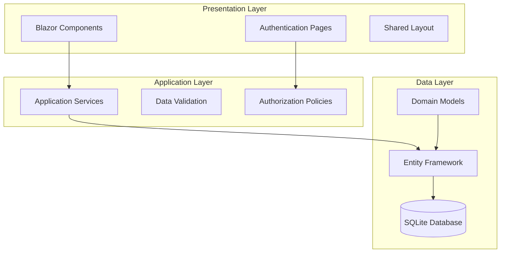

# AfyaConnect Lite - System Architecture

## Overview

AfyaConnect Lite is a web-based telemedicine platform built with .NET Blazor that enables patients to book medical appointments, consult with healthcare providers remotely, and manage basic health interactions online.

## Architecture Principles

- **Simplicity**: Clean, maintainable code with minimal complexity
- **Security**: Role-based access control and data protection
- **Scalability**: Modular design for future enhancements
- **Usability**: Intuitive user interface with responsive design
- **Performance**: Optimized database queries and efficient rendering

## Technology Stack

### Frontend
- **Framework**: Blazor Server (Interactive Server Components)
- **UI Components**: Bootstrap 5 for responsive design
- **State Management**: Blazor's built-in state management
- **Routing**: Blazor Router with secure routing

### Backend
- **Framework**: ASP.NET Core 8.0
- **Language**: C# 12
- **Authentication**: ASP.NET Core Identity
- **Authorization**: Policy-based authorization

### Data Layer
- **ORM**: Entity Framework Core 8.0
- **Database**: SQLite (for development) / SQL Server (for production)
- **Migrations**: Code-first migrations

## System Architecture



## Component Architecture

### Pages Structure
```
/Pages/
├── Account/
│   ├── Login.razor
│   ├── Register.razor
│   └── Logout.razor
├── Patient/
│   ├── Dashboard.razor
│   ├── BookAppointment.razor
│   └── AppointmentHistory.razor
├── Doctor/
│   ├── Dashboard.razor
│   ├── Appointments.razor
│   └── ConsultationNotes.razor
└── Admin/
    ├── Dashboard.razor
    ├── Users.razor
    └── Appointments.razor
```

### Services Architecture
```
/Services/
├── IAppointmentService.cs
├── AppointmentService.cs
├── IUserService.cs
├── UserService.cs
└── INotificationService.cs
```

## Database Schema

### Core Entities

#### ApplicationUser
- Inherits from IdentityUser
- Extended with healthcare-specific fields
- Role-based access (Patient, Doctor, Admin)

#### Appointment
- Links patients and doctors
- Status tracking (Scheduled, Completed, Cancelled)
- Consultation notes support

#### ConsultationNote
- Medical notes from doctors
- Timestamped entries
- Linked to appointments

## Security Architecture

### Authentication Flow
1. User registers/logs in via ASP.NET Identity
2. JWT-like authentication cookies issued
3. Role-based claims embedded in tokens

### Authorization Model
- **Policies**: Role-based access control
- **Secure Routing**: Protected page access
- **Data Protection**: Sensitive data encryption

### Security Measures
- Password complexity requirements
- Account lockout policies
- CSRF protection
- Input validation and sanitization

## Performance Considerations

### Database Optimization
- Indexed queries for appointment lookups
- Efficient pagination for large datasets
- Connection pooling

### Frontend Optimization
- Component lazy loading
- Minimal JavaScript dependencies
- Optimized bundle sizes

## Scalability Patterns

### Horizontal Scaling
- Stateless session management
- Database connection pooling
- Load balancer ready

### Vertical Scaling
- Memory-efficient data models
- Optimized query patterns
- Caching strategies

## Deployment Architecture

### Development Environment
- SQLite database
- Local file storage
- Development certificates

### Production Environment
- SQL Server database
- Azure Blob Storage (for files)
- SSL certificates
- Application Insights monitoring

## Monitoring and Logging

### Application Logging
- Structured logging with Serilog
- Error tracking and alerting
- Performance metrics

### Health Checks
- Database connectivity
- Service availability
- Resource utilization

## Future Extensibility

### Planned Enhancements
- Video conferencing integration
- Payment processing
- Mobile application
- API for third-party integrations

### Extension Points
- Plugin architecture for new features
- Configurable workflows
- External service integrations
